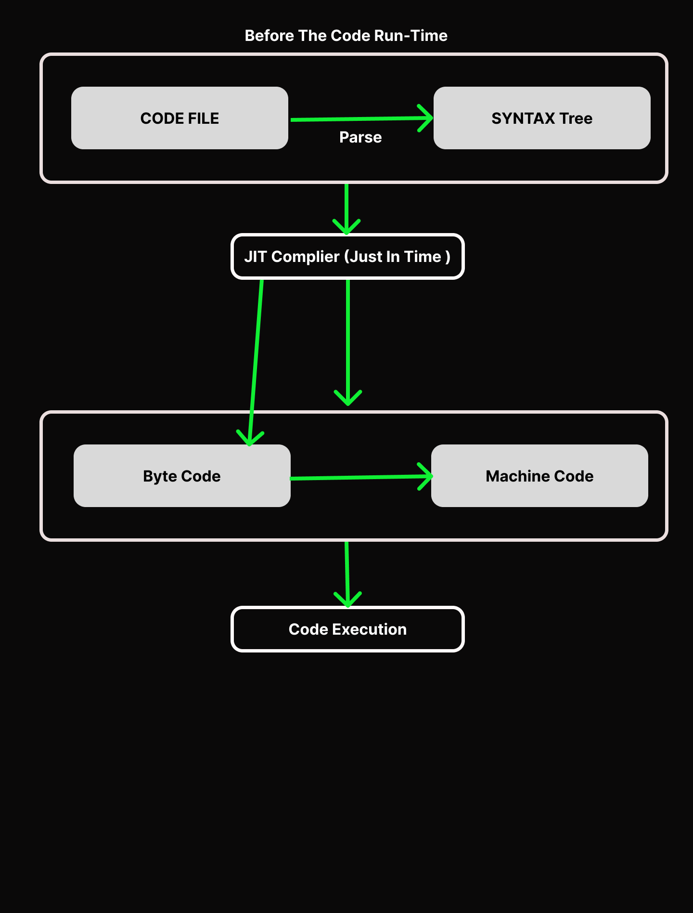

# JS Foundation

- [ ] Basics
- [ ]  OOPS
- [ ]  DOM

## Basics

- [ ] How JS executes the code
- [ ] Datatypes , variables and constants in JS
- [ ] Operations in JS
- [ ] Primitives in JS
- [ ] Non Primitives in JS
- [ ] Loops
- [ ] Array
 - [ ] Functions , arrow function ,THIS and context in JS.
 - [ ] High order function

### How JS executes the code

 1. **How to run JS code** 

  ```nodejs
  node fileName.js
  ```
 

 2. **Execution**

  node fileName.js


Step one is parsing the code file . in which it collect all the keyword (like console)  so that it would be know what to do in this file. This is also knows as kind of tokenization process.
Next Step is the creation of the syntax tree in this define where to go , what to do.

Just In time complier :-  
In JS now a days whole code is not execute all at once. It just translate the things onto an intermediary state so that things can be run faster but does not execute.

After that conversion phase / translation phase.
in this it go to byte code (0,1) then it goes to machine code



### JavaScript Visualized - Execution Contexts + call stack

There is  special environment to handle the transformation and execution of this JavaScript code. This environment is known as the Execution Context.

there are different kind of Execution Context in JavaScript

- Global Execution Context (GEC)
- Function Execution Context (FEC)
- Eval Execution Context

### Global Execution Context

Whenever the JavaScript engine receives a script file, it first creates a default Execution Context known as the Global Execution Context (GEC).

The GEC is the base/default Execution Context where all JavaScript code that is not inside of a function gets executed.

> For every JavaScript file, there can only be one GEC.

GEC performs the following tasks
  : it creates a global object where it is for Node.js and Window object for the browsers.
  :   reference the Windows object to 'this' keyword.
  :  Create a memory heap in order to store variables and function references.
  :   Then it stores all the functions declarations in the memory heap area and the variables in the GEC with initial values as 'undefined'.

> **Note**: Global Execution Context is only one in every code because the JS engine is single-threaded, and thus, only one global environment is possible for executing the JavaScript code.

### Functional Execution Context

FEC or Functional Execution Code is that type of context which is created by the JavaScript engine when any function call is found. Every function has its own execution context, and thus unlike GEC, the FEC can be more than one. Also, FEC can access the entire code of the GEC, but it is not possible for GEC to access all the code of the FEC. During the GEC code execution, a function call is initiated, and when found by the JS engine, it creates a new FEC for that specific function.

### Eval Function Execution Context

Any JS code that gets executed within the eval function creates and holds its own execution context. However, the eval function is not used by the JavaScript developers, but it is a part of the Execution Context.

### Execution Stack | Call Stack

 It stores the values in the form of LIFO (last in, first out).Code execution in two phase .First is Memory creation phase . Second is Execution Phase


First, the Global Execution Context is created. The first phase is the initialization phase, also known as the Memory Creation Phase, where variables are stored and assigned the value undefined. If a function is present in the code, its definition is stored.

The next phase is the Execution Phase, where variables are assigned values as per the code. When the function is called, it is added to the call stack, and a new Function Execution Context is created. In this context, a new memory creation phase is set up, followed by a new execution thread for the function's scope.

Once the function finishes executing, it is removed (or popped) from the call stack, and the code resumes from the next line, if there are any remaining lines.

Example 1:

 ```javascript
    function one(){
      console.log('It is the first function'); 
      two();
    }
    function two(){
      console.log('It is the second function'); 
      three();
    }
    function three(){
      console.log('It is the second function'); 
    }
    one();
    two();
    three();
 ```

 ```javascript
    let firstName = "harshit"
    const lastName = "Kumar Singh"
    function greet(name){
        const fullName = `${name} ${lastName}`
        return ` hi ${fullName}`
    }
    const message = greet(firstName)
    console.log(message)
 ```
 